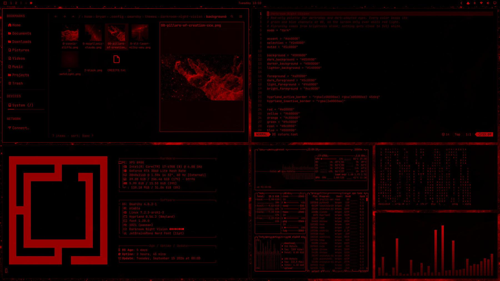

# Darkroom Night Vision

> *Live like you're driving the Keck telescopes.*

A red-only theme for [Omarchy](https://omarchy.org), built for dark rooms and
dark-adapted eyes.



Astronomers at the telescope, photographers in a black-and-white darkroom, and
pilots on night flights all work under dim red light. Red barely disturbs the
eye's rod cells, so night vision survives a glance at the screen. This theme
applies that rule to the whole desktop: every color keeps its green and blue
channels at `00`, so the display only ever emits red light. Hierarchy comes
from brightness alone, and nothing gets close to full white.

**It's also great on OLED screens.** Backgrounds are true black (`#000000`),
so those pixels switch off entirely, which saves power and looks inky. And
because nothing lights the blue subpixels, the ones that wear out fastest on
most OLED panels, the theme is gentle on the panel too.

## Install

```bash
omarchy theme install https://github.com/Bryan-Legend/omarchy-darkroom-night-vision-theme
```

Or open the Omarchy menu (`Super + Alt + Space`) and choose
**Install › Style › Theme**, then paste the URL above.

## What's included

- **Palette** — terminals, btop, Neovim, the Omarchy shell, Hyprland borders,
  and every other app Omarchy themes from `colors.toml`, all in reds from
  `#140000` to `#ff0000`.
- **Wallpapers** — four astronomy photographs converted to red-only (verified:
  zero green and blue), plus a faint safelight glow and plain black. The JWST
  *Pillars of Creation* is the default.
- **VS Code** — Omarchy's generated theme with the palette filled in, except
  that inactive tabs, panel titles, activity bar icons and unfocused title bars use
  `#800000` instead of the muted `#5c0000`, which was too dark.
  It's a high-contrast theme (`"type": "hc"`) so that selections can be
  inverted to black on red everywhere, including the editor: VS Code only
  applies a selected-text color in high-contrast themes. The editor's
  selection is only inverted if VS Code loads the theme as `hc-black`.
- **Icons** — `Yaru-red-dark`.
- **Lock screen and boot logo** in red.

## Optional extras

Some parts of the desktop can't be themed by a colors file alone. The `extras/`
folder has an installer for two of them:

```bash
~/.config/omarchy/themes/darkroom-night-vision/extras/install.sh
```

- **GNOME apps (Nautilus and other GTK/libadwaita apps).** Links
  `~/.config/gtk-4.0/gtk.css` and `~/.config/gtk-3.0/gtk.css` to this theme's
  stylesheets through Omarchy's current-theme folder, so other themes keep the
  stock GNOME look. Nautilus's full-color folder icons and thumbnails are
  pushed into pure red with a CSS filter. Restart GNOME apps (`nautilus -q`)
  after switching themes. If you already have your own `gtk.css`, the
  installer leaves it alone.
- **Red screensaver.** Omarchy's screensaver effects choose their own colors.
  A small watcher switches on a red-only Hyprland screen shader while the
  screensaver is open — only when this theme is active — and turns it off
  again afterwards. It starts at login via `~/.config/hypr/autostart.lua`.

Remove them with `extras/install.sh uninstall`.

## Night-vision notes

- **Keep your monitor dim.** A dim red screen protects night vision far better
  than a bright one.
- **Terminal colors collapse into reds.** ANSI green, blue, yellow and friends
  are all shades of red here, so added and removed lines in `git diff` differ
  only in brightness. Git can add a text style to tell them apart:

  ```bash
  git config --global color.diff.new "brightred italic"
  git config --global color.diff.old "red"
  ```

- **App content isn't themed.** Web pages, photos and video keep their real
  colors — a theme only colors the interface around them.

## Credits

| Wallpaper | Credit | License |
|---|---|---|
| Pillars of Creation (JWST NIRCam, 2022) | NASA, ESA, CSA, STScI; J. DePasquale, A. Koekemoer, A. Pagan (STScI) — [esawebb.org](https://esawebb.org/images/weic2216b/) | CC BY 4.0 |
| Cosmic Cliffs in Carina (JWST NIRCam) | NASA, ESA, CSA, and STScI — [esawebb.org](https://esawebb.org/images/weic2205a/) | CC BY 4.0 |
| Straight to the Milky Way's heart | G. Hüdepohl (atacamaphoto.com)/ESO — [eso.org](https://www.eso.org/public/images/huedepohl-02/) | CC BY 4.0 |
| The VLT's Laser Guide Star (Magellanic Clouds) | G. Hüdepohl (atacamaphoto.com) — [eso.org](https://www.eso.org/public/images/gerd_huedepohl_2/) | CC BY 4.0 |

All photographs were cropped to 16:9 and converted to red-only; details in
[`backgrounds/CREDITS.txt`](backgrounds/CREDITS.txt).

## License

The theme's own files are [MIT](LICENSE). The photographs are third-party works
under the licenses above.
